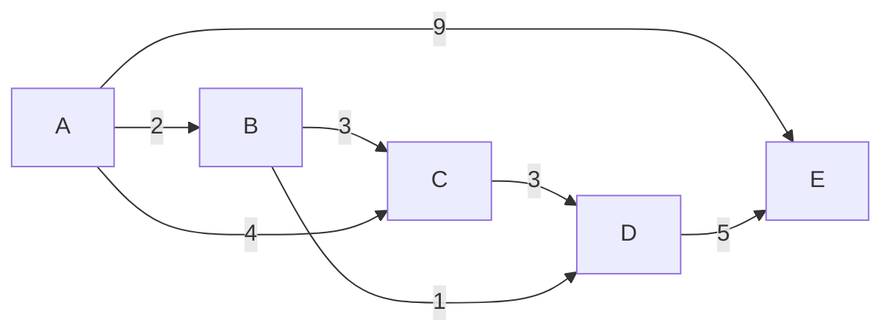
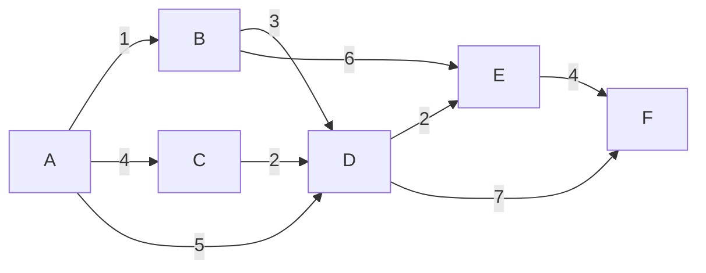

# Graphs for testing Dijkstra's algorithm

## Graph 1
*Modified from [DSA Day 7](https://olindsa2024.github.io/in_class/day07).*

```mermaid
graph LR
    A --2--> B
    B --3--> C
    A --4--> C
    C --3--> D
    B --1--> D
    A --9--> E
    D --5--> E
```

## Graph 2

```mermaid
graph LR
    A --1--> B
    A --4--> C
    A --5--> D
    B --3--> D
    B --6--> E
    C --2--> D
    D --2--> E
    D --7--> F
    E --4--> F
```